# Build, Run and Deploy a Containerized Web Application using Docker and Amazon Elastic Container Service (ECS)

This lab is provided as part of **[AWS Summit Online](https://aws.amazon.com/events/summits/online/)**, click [here](https://bit.ly/2yLtZqL) to explore the full list of hands-on labs.

ℹ️ You will run this lab in your own AWS account. Please follow directions at the end of the lab to remove resources to avoid future costs.

## What will we build in this lab?

In this lab we will learn how to build and run a containerised application. We will then use the Amazon Elastic Container Service to host and run this container in the Cloud.

The diagram below illustrates the architecture the lab will be using. 


>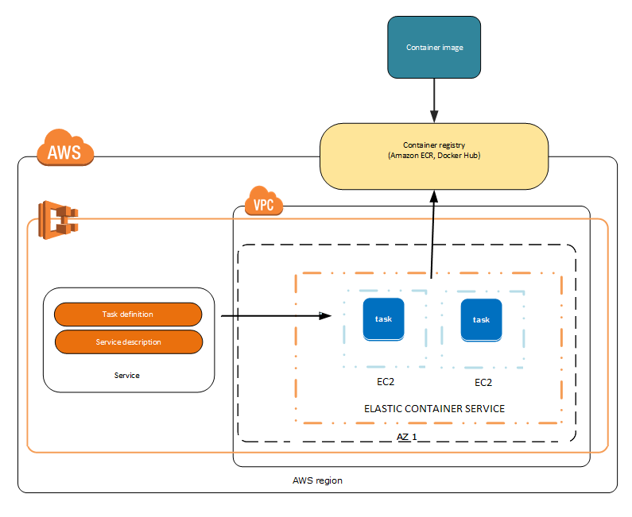

## Let's get started

SELECT REGION

- On top right corner - **Switch to N.Virginia (us-east-1)**

First we will provision our network VPC and deploy an ECS Cluster
The ECS cluster consists of the networking components and the underlying EC2 hosts that our containers will run in.

## Provision the ECS Cluster - virtual network and hosts 

Click the Launch Stack button below to provision your cluster. 

This will take a few minutes while this is running you can move on with the next steps.

<a href="https://console.aws.amazon.com/cloudformation/home?region=us-east-1#/stacks/new?stackName=ecs-cluster&templateURL=https://dev-day-bucket.s3-ap-southeast-2.amazonaws.com/lab-templates/1_ClusterTemplateV3.template">

</a>


## Provision the Dev Environment - Cloud9 IDE

While the cluster is provisioning let's initialize our development environment.

Click on the Launch Stack button below to provision your IDE in the cloud.

<a href="https://console.aws.amazon.com/cloudformation/home?region=us-east-1#/stacks/new?stackName=dev-environment&templateURL=https://dev-day-bucket.s3-ap-southeast-2.amazonaws.com/lab-templates/5_Lab-Env-C9.yaml">

</a>

- Once the Cloud9 Stack is completed, go to ***Services*** and go to ***Cloud9*** on the AWS Web console
- On the left hand pane click on ***Your Environments***
- Open the ***ECS Docker Cloud9 Env*** By clicking on ***Open IDE***  - this is your IDE in the cloud.
- When you open cloud9 it will automatically clone this git repo onto it's local file system
- This has all the files you need pre downloaded
- Have a browse of the folder structure to see what files are in there

>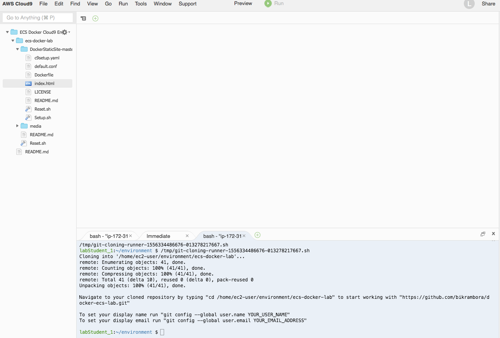

## Install and run Docker in the Cloud9 IDE

Inside Cloud9 
- Open the Terminal change directory to the correct folder & **Reset/Initiate the lab**
```
$ cd ~/environment/ecs-docker-lab/

$ chmod +x Reset.sh

$ ./Reset.sh

$ clear

```
- Install and run docker
```
$ sudo yum update -y

$ sudo yum install -y docker

$ sudo service docker start

$ sudo usermod -a -G docker ec2-user
```

- Verify that docker is installed and running correctly

```
$ docker info
```

You have now installed docker successfully ✅

## Build and Run your Docker Container Locally

Let's build a docker image and run a docker container locally in cloud9

>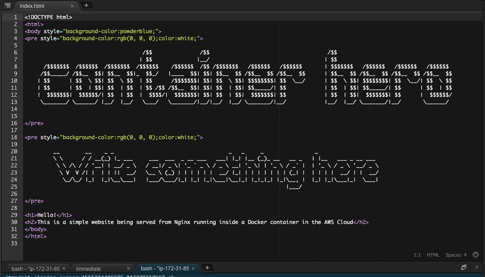

- Open the ***index.html*** file inside the ***ecs-docker-lab*** folder inside ***DockerStaticSite-master*** folder and edit the ***Write something here***

- ***Save*** your edited HTML File

- Build a container Image from the DockerFile
```
$ docker build -t staticsite:1.0 DockerStaticSite-master/
```

- Run a Container from the freshly built image
```
$ docker run -itd \--name mycontainer \--publish 8080:80 staticsite:1.0
```
- Test if your container is running locally
```
$ curl http://localhost:8080
```

If you get an HTML page as a response, then the container is running successfully - Well Done! ✅

## Setup a Docker Image Repository in AWS

Now that your containerized application is running locally, let's push
your docker image to an Elastic Container Repository (ECR) in
the cloud

Let's create an Elastic Container Repository. This will hold our container images.

>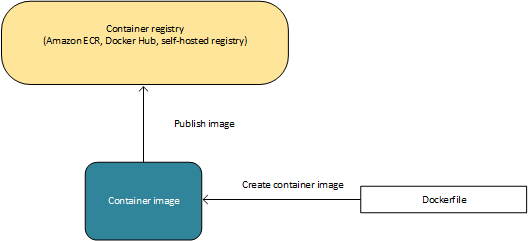

- Navigate to the ECS (Elastic Container Service) console  on another tab and click on
***Repositories***

Let's create an Elastic Container Repository. This will hold our container images.

- Click on ***Create repository***
- Set the repository name as ***ecs-lab-repo***
- Your new repository will now be created ✅

>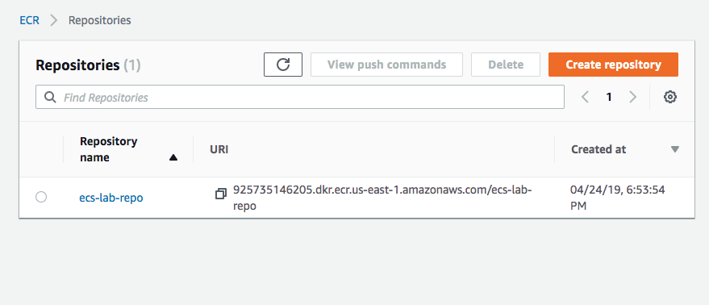

- Click on ***ecs-lab-repo***
- Click on ***Permissions*** on the left to view permissions
- Click on ***Edit policy JSON*** 
- In the text below replace ***YOUR_AWS_ACCOUNT_NUMBER*** with your actual ***AWS Account Number***
- Paste the edited text into the box and click ***Save***
   
```
{
  "Version": "2008-10-17",
  "Statement": [
    {
      "Sid": "AllowPushPull",
      "Effect": "Allow",
      "Principal": {
        "AWS": "arn:aws:iam::YOUR_AWS_ACCOUNT_NUMBER:root"
      },
      "Action": [
        "ecr:BatchCheckLayerAvailability",
        "ecr:BatchGetImage",
        "ecr:CompleteLayerUpload",
        "ecr:GetDownloadUrlForLayer",
        "ecr:InitiateLayerUpload",
        "ecr:PutImage",
        "ecr:UploadLayerPart"
      ]
    }
  ]
}
```

Now we can push/pull images to/from this repo ✅

## Push you Docker Image into ECR


We will now push your new docker image to the cloud


- Click on Images on the left

- Click on "**View Push Commands** " (top right)

>

**You will see a set of commands.**

>

- Go back to your ***cloud9*** environment 
- Change directory into the correct folder

```
$ cd DockerStaticSite-master/
```

**Follow the steps of the push commands to build and push the new modified image to the cloud repo**

- Copy paste the commands into cloud9 terminal

- Make sure you run them in the right folder

- You will see that the container image is **pushed ========>** to the cloud

- Now your container has successfully been pushed to the cloud

- - Once pushed you will see an **IMAGE URI** for the new image, **Copy This**, we will need this later ✅ 

>


  
## Create an ECS Task Definition

>

A task definition is required to run Docker containers in Amazon ECS.

Your entire application stack does not need to exist on a single task definition, and in most cases it should not. Your application can span multiple task definitions by combining related containers into their own task definitions, each representing a single component.

In an earlier step we provisioned our networks and ECS cluster through clooudformation. That should have finishd by now.
We will now deploy our newly pushed docker image to the cluster. So that we can run the container in the cloud.

- Go to **Services** and navigate to the **Elastic Container Service** Dashboard.
- In the navigation menu on the **left**, click **Task Definitions.**

>

- Click ***Create new Task Definition***
- Select ***Launch Type*** as ***EC2*** and click next

>

- Put in the ***Task Definition Name*** as ***simplewebtask***
- Scroll down and click ***Add Container***

>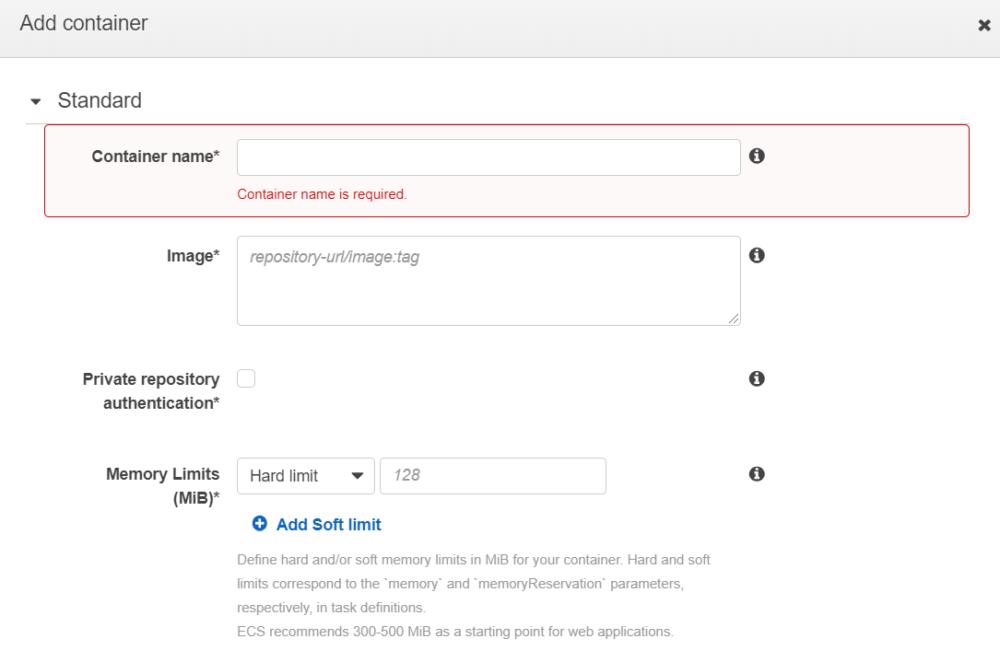

- Put in the name as ***WebContainer***
- In  ***Image*** paste your ***IMAGE URI*** that we copied earlier
- In ***Memory Limit*** put in ***128***
- In Port Mapping ***Host Port*** ***80*** | ***Container Port*** ***80***
- Scroll to bottom and click ***Add*** to add in the container
- Scroll to bottom and click ***Create*** to complete creating the task

This will create a new Task. Note the Version Number. The
new version will use the latest container image. i.e. the image that you
just pushed. ✅

## Create an ECS Service

An Amazon ECS service enables you to run and maintain a specified number of instances of a task definition simultaneously in an Amazon ECS cluster.

- in the left navigation pane, click **Clusters**.

>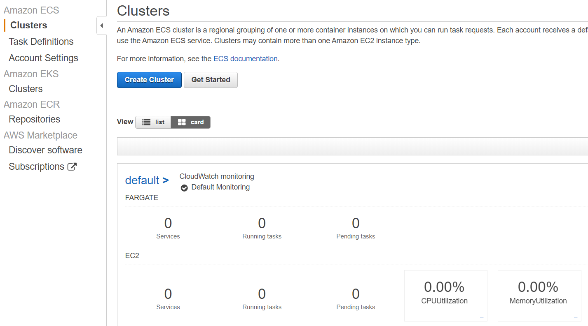

- in the **Clusters** window, click **default**

>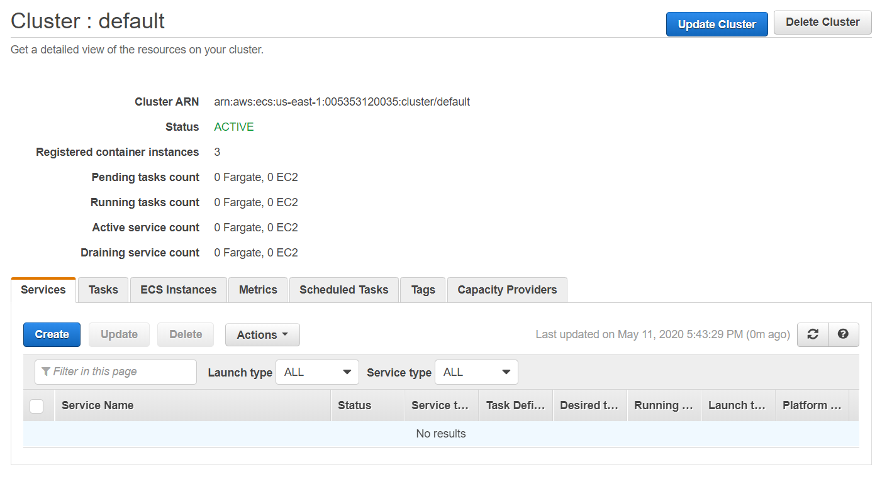

- on the **Services** tab,
- Click ***Create*** 

>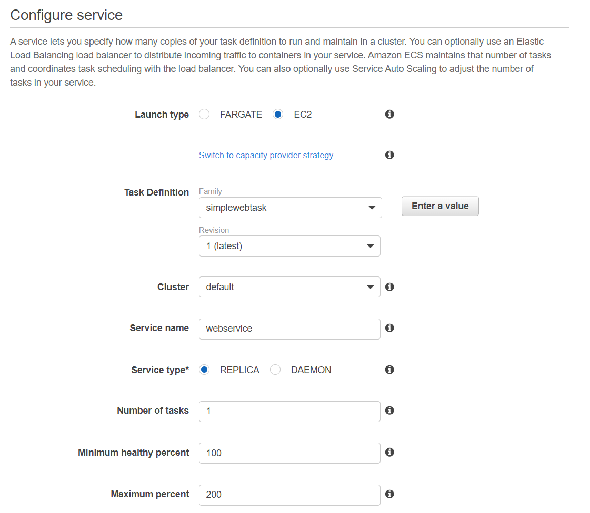

Enter the folowing parameters

- Launch Type is ***EC2*** 
- Task Definition  ***simplewebtask***
- Cluster ***default***
- Service Name ***webservice***
- Number of Tasks ***1***

Next Step : Configure Network

>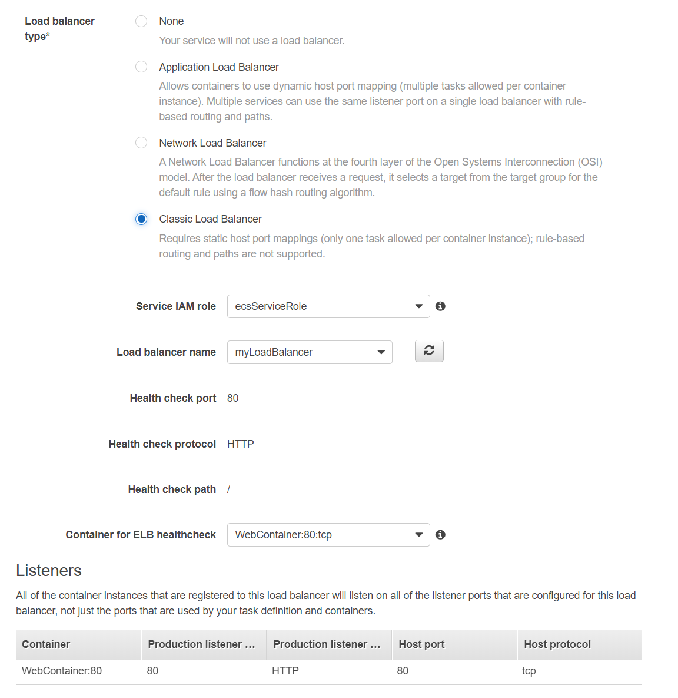

- Health check grace period ***10*** Seconds
- Load balancer type is ***classic load balancer***
- ***Disable*** Service Discovery if it's present

Next Step : Setup Auto Scaling

- Select Do ***NOT*** adjust the services desired count

Next Step

- click ***Create Service***
  
- Once create is complete click ***View Service***

Well done your ECS Service has now been created ✅

Now ECS is provisioning the desired number of Tasks in our cluster. Once created the tasks will register with our loadbalancers which we provisioned in our initial cloudformation script.


>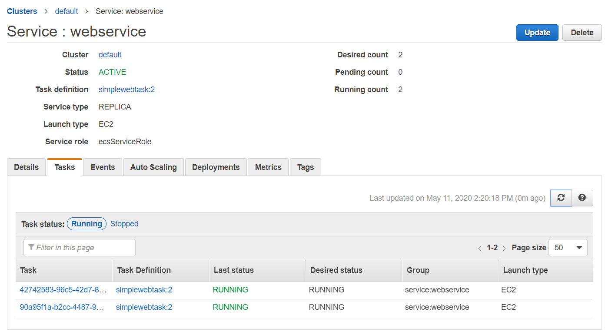


## Viewing the Running Website

In your ecs service page
- Click on the ***details*** tab
- Click on ***myloadbalancer*** , this will take you to you load balancer page
- Copy your load balancers ***DNS Name*** and paste in a new browser tab

>

>


Congratulations! Your Containerized web application is now running in
the cloud ✅


<details>
  <summary>Troubleshooting steps</summary>

    ## If your Service Creation Failed try the steps below to redeploy

    - click **Update** then click on **Revision**

    - **Revision:** select the *latest version that you just created*

    - **Force New Deployment --** check this box & turn it on

    - click **Next Step**

    - on **Step 2**, click **Next Step**

    - on **Step 3**, click **Next Step**

    - on **Step 4**, click **Update Service**

    This will deploy a new version of the application.

    * on the **Launch Status** page, click **View Service**

    * on the **Service: myService** page, click the **Events** tab.

    ## Check if the new version on the application has successfully deployed

    Wait a few minutes. Monitor the process of draining connections and
    stopping tasks till the service reaches a steady state.

    You may need to click the **Refresh** button to see the new events.

    Once the events says "service webService has reached a steady state."

* Go to EC2 service page 

* On the left hand pane click on load balancers

* search and click on **myLoadBalancer**

>

* Paste in the **Load Balancer\'s DNS name** to see the new version of the
app running in the cloud

>

Congratulations! Your Containerized web application is Now Running in
the cloud

</details>


# Clean Up Steps ✅

It is important to execute these steps in order to no longer incur additional charges for the resources that you have provisioned.

- **DELETE** the Cloud formation stack for the ecs cluster

- **DELETE** the cloud for the cloud9 dev environment
  
- **DELETE** any child cloudformation stacks spawned during this lab

## Further reading

https://docs.aws.amazon.com/AmazonECS/latest/developerguide/docker-basics.html

https://docs.aws.amazon.com/AmazonECS/latest/developerguide/Welcome.html

https://docs.aws.amazon.com/AmazonECS/latest/developerguide/AWS_Fargate.html

